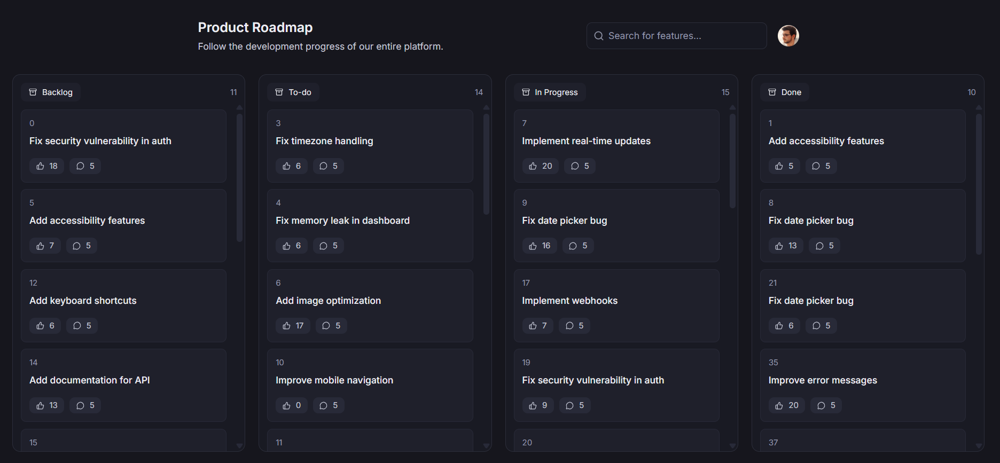

# Product Roadmap

  </a>

## 💻 Descrição

Desenvolvi um Product Roadmap em formato de quadro estilo Kanban, incorporando conceitos de Scrum. Usuários podem logar com GitHub, dar likes e comentar nas features de um software hipotético.

## 🛠 Tecnologias

🖥️ Front-end
- Server vs Client Components
- Filtragem
- Requisições cacheadas em Server Components
- Requisições dependentes de login em Client Components
- Suspense para partial rendering
- Parallel e Intercepting Routes
- Diretiva "use cache"
- Open Graph
- Gerenciamento de URL state com nuqs
- Projeto focado em performance, arquitetura moderna e boas práticas no Next.js App Router.

## 💛 Contato

vinibrunheroto12@gmail.com
